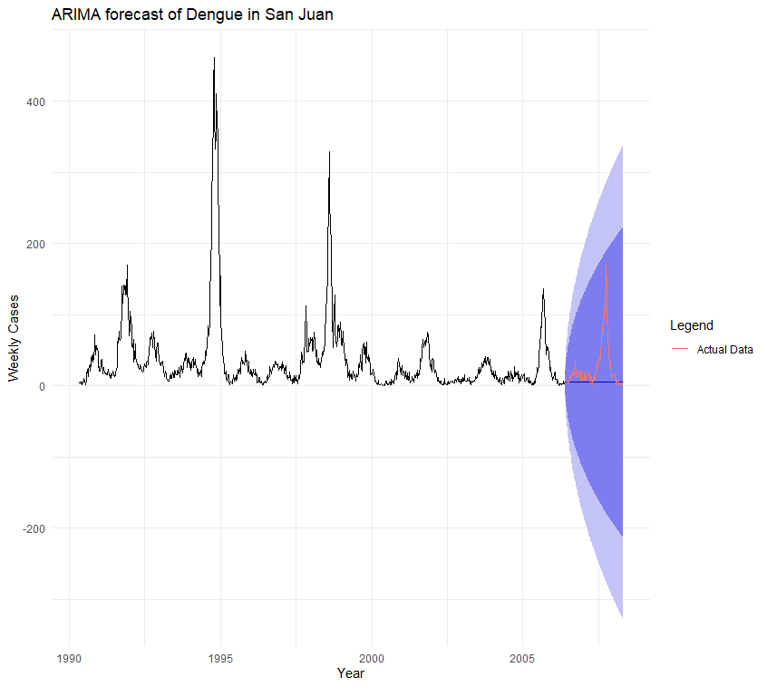
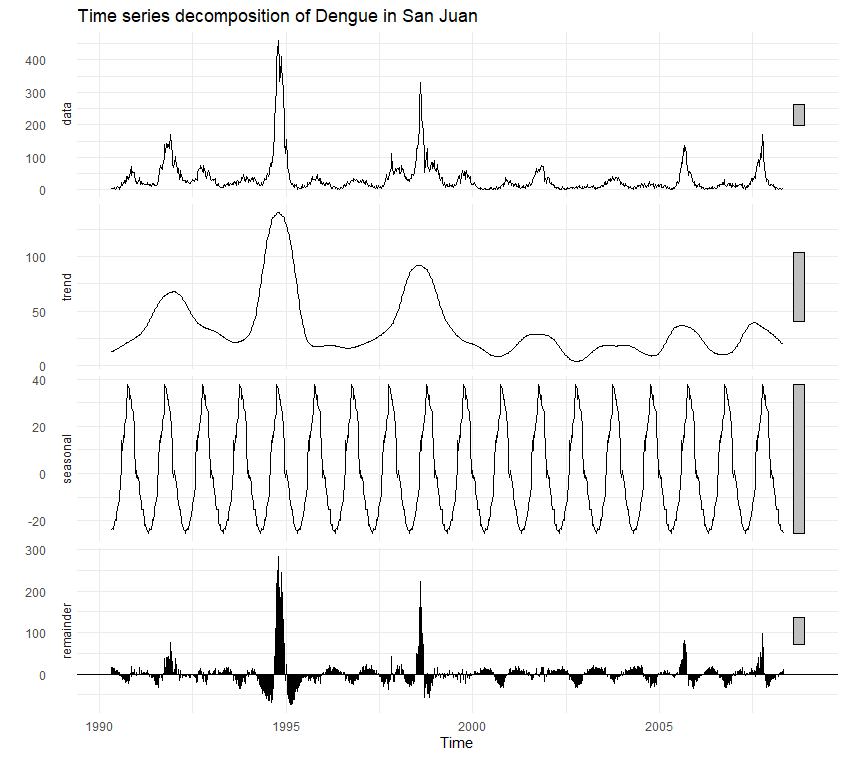
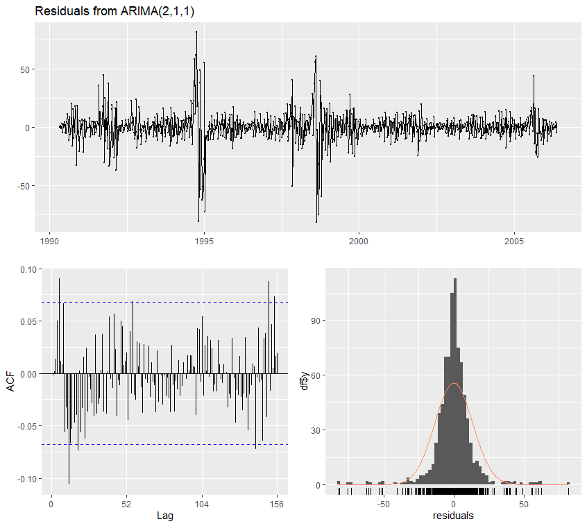

# 🦟 Forecasting Dengue Outbreaks in San Juan: A Time Series Analysis
  

> **Project Abstract:** This project utilizes 18 years of disease surveillance data to forecast Dengue fever cases in San Juan, Puerto Rico. Using **Seasonal ARIMA (Auto-Regressive Integrated Moving Average)** modeling, it identifies cyclical epidemic patterns and predicts future outbreaks with an 80% confidence interval.

---

## 📊 1. The Goal: Predicting Epidemics
Dengue fever is a mosquito-borne viral infection that poses a significant public health burden in tropical regions. Accurate forecasting is critical for resource allocation and vector control.

**Research Question:** *Can we use historical surveillance data to predict future Dengue outbreaks up to 2 years in advance?*

---

## 📈 2. Key Results: The Forecast
The model successfully predicts the seasonal spikes of Dengue.

  
   
  <em>Figure 1: ARIMA(2,1,1) Forecast for 2007-2009. The blue line represents the model's prediction, and the shaded blue region is the 80-95% Confidence Interval. The red line shows the actual validation data.</em>

> **Interpretation:** The model correctly anticipates the seasonal timing of outbreaks (peaking in late autumn). However, the magnitude of the 2008 epidemic (the large red spike) exceeded the model's upper confidence bound, suggesting external factors (e.g., extreme weather events) drove that specific "super-spreader" event.

---

## 🔬 3. Data Diagnostics & Decomposition
Before modeling, the time series was decomposed using **STL (Seasonal-Trend-Loess)** to isolate the signal from the noise.

  
   
  <em>Figure 2: Decomposition of Weekly Dengue Cases (1990–2008).</em>

* **Trend (2nd Panel):** Reveals the underlying intensity of outbreaks, highlighting major epidemic years in 1994 and 1998.
* **Seasonality (3rd Panel):** **Critical Finding.** A perfect, repeating annual wave confirms that Dengue in San Juan is strictly seasonal, peaking around Weeks 40-50 each year.

---

## 🛠️ 4. Methodology
The analysis followed a rigorous Box-Jenkins approach for Time Series modeling.

### **A. Preprocessing**
* **Data Source:** DengueAI Dataset (DrivenData).
* **Imputation:** Missing climate and case data points were filled using **Linear Interpolation** (`na.approx`) to maintain time-series continuity.
* **Stationarity:** Verified using the **Augmented Dickey-Fuller (ADF) Test**.
    * *Result:* `p = 0.01` (< 0.05), confirming the series is stationary and does not require manual differencing.

### **B. ARIMA Modeling**
The `auto.arima()` function selected the optimal parameters based on the lowest AIC score:

| Parameter | Value | Interpretation |
| :--- | :--- | :--- |
| **AR (p)** | **2** | Current cases are correlated with the previous **2 weeks** of data. |
| **I (d)** | **1** | First-order differencing was applied to remove non-stationary trends. |
| **MA (q)** | **1** | The model corrects for the error term from the previous **1 week**. |
| **Seasonality** | **[52]** | The model accounts for the 52-week annual cycle. |

### **C. Model Validation (Residuals)**

  
   
  <em>Figure 3: Diagnostic plots of model residuals.</em>

* **ACF Plot (Bottom Left):** Most autocorrelation bars fall within the blue dashed confidence bounds, indicating the model has successfully captured the time-dependent structure.
* **Histogram (Bottom Right):** The residuals follow a **Normal Distribution** (Bell Curve), confirming the model is unbiased and statistical assumptions are met.

---

## 📂 Repository Structure
* `data/`: (Not included due to license) Download `dengue_features_train.csv` from DrivenData.
* `01_cleaning.R`: Data merging, date conversion, and missing value imputation.
* `02_decomposition.R`: STL decomposition and stationarity testing (ADF test).
* `03_arima_model.R`: Model fitting, residual diagnostics, and forecasting (The main analysis).

---
